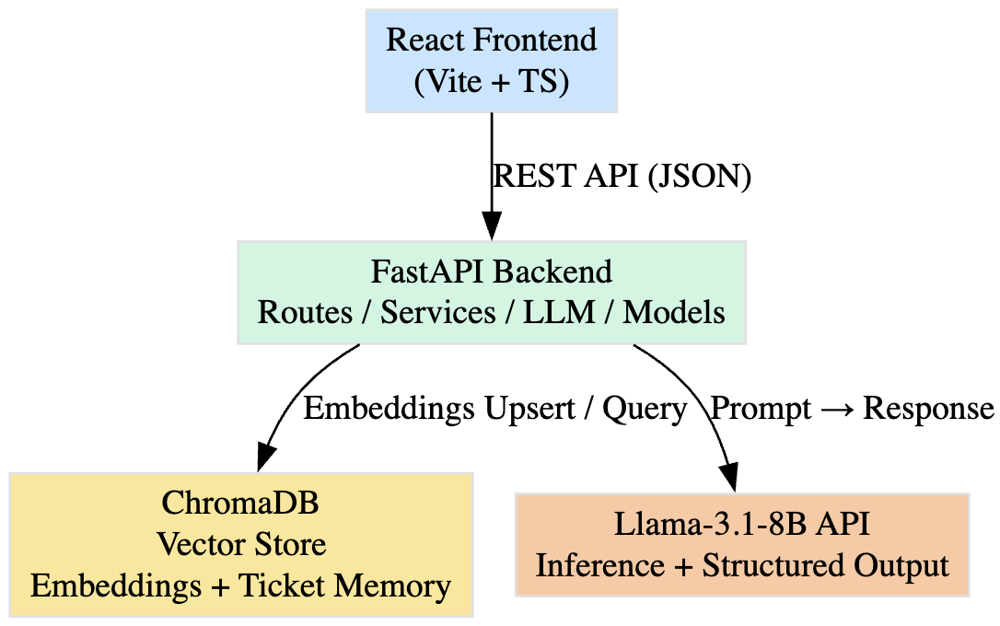

## Enterprise Ticket Agent  
AI-powered IT Helpdesk (FastAPI + React + ChromaDB + Llama-3.1-8B)



The **Enterprise Ticket Agent** is an AI-powered IT Helpdesk system that automatically:
- Creates structured IT tickets
- Generates agent-quality responses
- Suggests troubleshooting steps
- Asks targeted follow-up questions
- Maintains a running conversation thread
- Retrieves similar historical incidents using embeddings (ChromaDB)

This project runs:
- **Backend:** FastAPI + ChromaDB + Llama-3.1-8B  
- **Frontend:** React + TypeScript + Vite  
- **Vector Store:** ChromaDB  
- **LLM Provider:** Llama-3.1-8B (via your configured LLM service)

---

# Folder Structure

```

enterprise-ticket-agent/
│
├── backend/
│   ├── app/
│   │   ├── main.py
│   │   ├── routes/
│   │   │   ├── health.py
│   │   │   └── tickets.py
│   │   ├── models/
│   │   │   └── tickets.py
│   │   ├── services/
│   │   │   ├── agent_orchestrator.py
│   │   │   └── vector_service.py
│   │   └── llm/
│   │       └── llm_service.py
│   ├── requirements.txt
│   ├── Dockerfile
│   └── .env.example
│
├── frontend/
│   ├── src/
│   │   ├── App.tsx
│   │   ├── components/
│   │   │   └── TicketDetail.tsx
│   │   └── api/
│   ├── package.json
│   ├── vite.config.ts
│   └── Dockerfile
│
├── docker-compose.yml
├── LICENSE
├── README.md
└── .github/
└── workflows/
└── ci.yml

````

---

# Backend (FastAPI)

### Start locally:

```bash
cd backend
uvicorn app.main:app --reload
````

### API Routes

| Method | Endpoint                        | Description         |
| ------ | ------------------------------- | ------------------- |
| POST   | `/tickets`                      | Create new ticket   |
| GET    | `/tickets`                      | List ticket history |
| GET    | `/tickets/{ticket_id}/thread`   | Get full thread     |
| POST   | `/tickets/{ticket_id}/followup` | Add follow-up       |
| POST   | `/tickets/{ticket_id}/close`    | Close ticket        |

---

# Frontend (React + Vite)

```bash
cd frontend
npm install
npm run dev
```

The app will open at [http://localhost:5173/](http://localhost:5173/)

---

# LLM Integration (Llama-3.1-8B)

The backend uses:

```
model_name="llama-3.1-8b-instruct"
```

Inside:

```
backend/app/services/llm_service.py
```

You must set:

```
LLM_API_KEY=your-api-key
LLM_API_BASE=https://your-provider-endpoint
```

---

# ChromaDB (Vector Store)

Stored under:

```
./chroma/
```

Used to store:

* Ticket metadata
* Message thread history
* Embeddings for similar incidents

---

# Docker Support

### Build and run full stack + ChromaDB:

```bash
docker-compose up --build
```

---

# GitHub Actions CI/CD

The repository includes:

```
.github/workflows/ci.yml
```

This performs:

* Python linting
* Backend tests (if added)
* Frontend build
* Docker build validation

---

# MIT License

This project is licensed under the MIT License (see LICENSE file).

---

# Requirements

### Backend

* Python 3.10+
* FastAPI
* ChromaDB
* Uvicorn
* LLM provider SDK

### Frontend

* Node 18+
* React
* Vite
* TypeScript

---

# Troubleshooting

**Blank screen in React**
→ Usually caused by a bad thread object. Check API response for missing fields.

**Thread 404 error**
→ Means no thread exists yet; backend now auto-creates thread on ticket creation.

**Embedding / Chroma errors**
→ Delete local vector store:

```
rm -rf chroma/
```

---

# Author

Daniel Jemiri — Cloud, AI, Data, and Systems Engineering

````
---